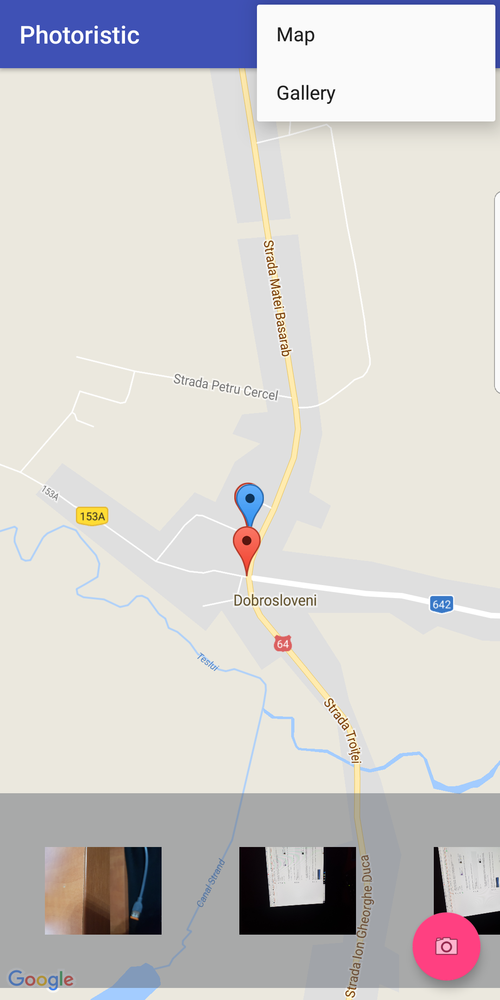

# Android - Management of personal photos while making use of metadata and google maps

The app does the following:

* Visually browse previews of photos.
* Shows markers on the map using each photo metadata.
* Lets the user inspect photos for further details.
* Lets the user use the phone's camera to take more photos.
* Sends photo and metadata to a server on user's request.
